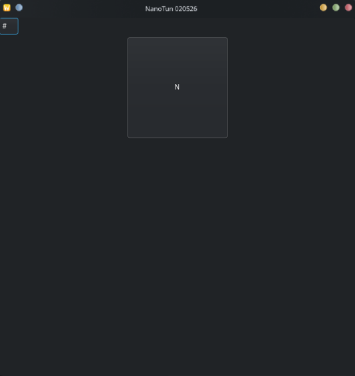

# NanoTun
__ВПН Конфигуратор__

    
  

### Главные фишки 👻
- __2__ Ядра для впн (Xray и Singbox) которые могут работать в 2 режимах - Автоматический (приложение само выбирает для которых Xray, а для которых Singbox)
- Раздельное туннелирование - обход приложений (которые выберет пользователь) и .ru / .cn (По желанию)
- Режим __TUN__ и __TAP__
- Хороший интерфейс
- Поддержка больших конфигов (_до 5 тысч._)

### Поддержка ♥️
___Пока что вы можете поддержать нас отправив Feature Request / Bug Report, это поможет нам устранить огромные ошибки!___
_
